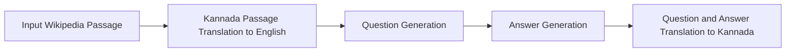

# Synthetic Question-Answer Generation over Wikipedia Documents

This notebook demonstrates how to use the `sdg` package to generate synthetic question-answer pairs using Kannada Wikipedia with Granite 3.3 2B as the teacher model. Since Granite 3.3 2B doesn't support Kannada we translate the wikipedia documents to ENglish, generate question-answer pairs in ENglish and translated the generated question-answer pairs back to Kannada. We use Facebook NLLB translation model. 

## Table of Contents
- [Overview](#overview)
- [Generation Pipeline Overview](#reasoning-pipeline-overview)
- [Notebook Structure](#notebook-structure)
  - [Creating ICLs](#creating-icls)
  - [Generating Data](#generating-data)

## Overview

The workflow includes:

- Defining an SDG pipeline using a YAML flow file
- Creating custom SDG blocks for providing translation supprot

## Generation Pipeline Overview



### Kannada Passage Translation to English
We use Facebook's `facebook/nllb-200-distilled-600M` model to translate Kannada Wikipedia passages to English.

### Question Generation

* Our SDG pipeline leverages the generation capabilities of language models to generate a diverse set of question and answers based on the translated passages.

### Answer Generation

* Once we generate questions, we leverages the generation capabilities of language models to generate answer to the question grounded on the document.

### Question-Answer Translation
We use Facebook's `facebook/nllb-200-distilled-600M` model to translate generated question-answer pairs back to Kannada.

## Notebook Structure
The notebook is logically divided in below sections:
### Creating ICLs
- SDG works by creating a set Question-Answer pairs from the source document.
- To do this we first need to create an example document and a set of Question-Answer pairs. The SDG will use these to generate more synthetic Question-Answer pairs on top of all your document.

### Generating Data
- In next few sections you will:
    - Learn how we added prompts for the teacher model
    - Generated data

## How does the generated data look like?

#### Input Raw Document
```text
"Chapter_III

Section_27

not extend to (a) the intentional causing of death, or to the attempting to cause death; (b) the doing of anything which the person doing it knows to be likely to cause
```


### Generated data

#### Generated Question-Answer Pair
```text
Scenario: Suppose I urge my friend C to steal a car from a dealership, knowing full well it's illegal. Although I don't physically assist in the theft, C goes ahead and takes the vehicle. Can I face the same legal repercussions for abetting this crime under the Bharatiya Nyaya Sanhita?

Response: In accordance with Chapter III, Section 27 of the Bharatiya Nyaya Sanhita, yes, you can be held equally liable as the perpetrator under such circumstances. This principle applies to situations where an individual intentionally abets a crime, including the act of theft in this case, even when they do not physically participate in the commission.
```

#### Translated Question-Answer Pair
```text
Scenario:


Response:
```

